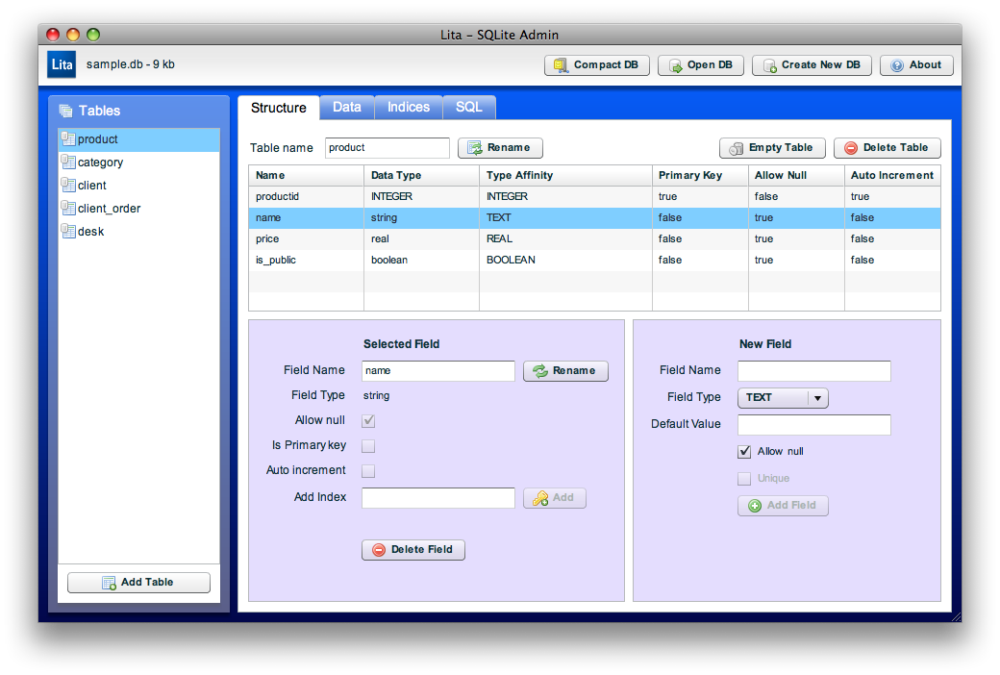

## Lita - Adobe AIR SQLite Administration Tool

<table>
<tr><td>

</td><td>
Original home page: http://www.dehats.com/drupal/?q=node/58
</td></tr>
</table>

This is a fork of [davidderaedt/Lita], updated to include all missing
components and compilable under latest Adobe Flex (v4.6) and AIR SDK
(v17.0.0.124).

### How to compile

With Apache Ant (v1.9.4). See ```build.properties``` for installation
location of Adobe Flex and AIR SDK.

- first create signing key (or provide your own in subdirectory ```keys```):  
  ```$ ant key```  
  This creates subdirectory ```keys``` with a self-signed certificate ```signingCert.pfx```.
- compile and build signed AIR package:  
  ```$ ant```  
  This creates subdirectory ```deploy```, where SWF and signed AIR packages are stored.
- run with debug output:  
  ```$ ant test```

### Screenshot



[davidderaedt/Lita]: https://github.com/davidderaedt/Lita
